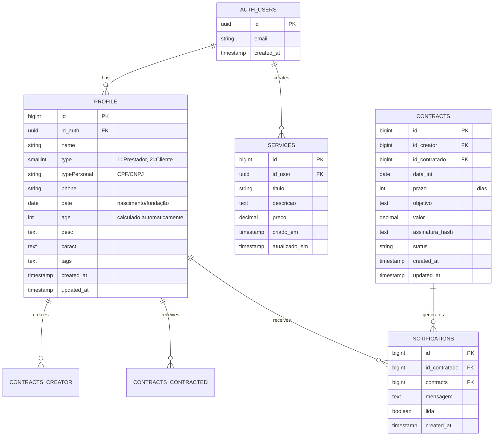
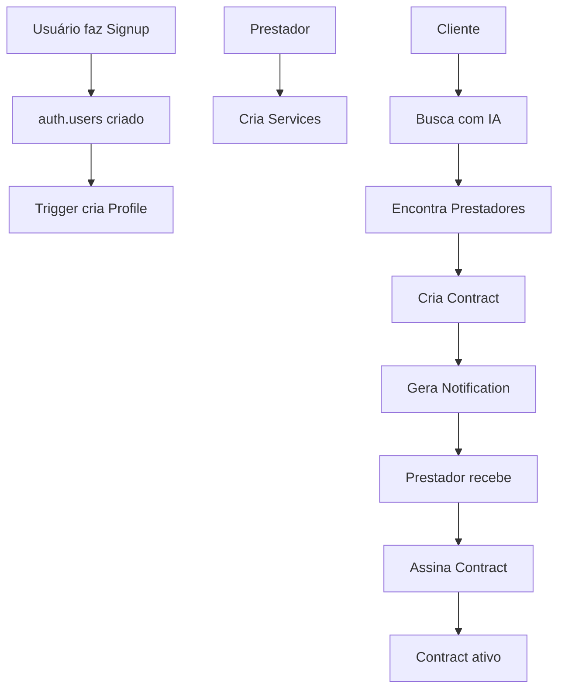
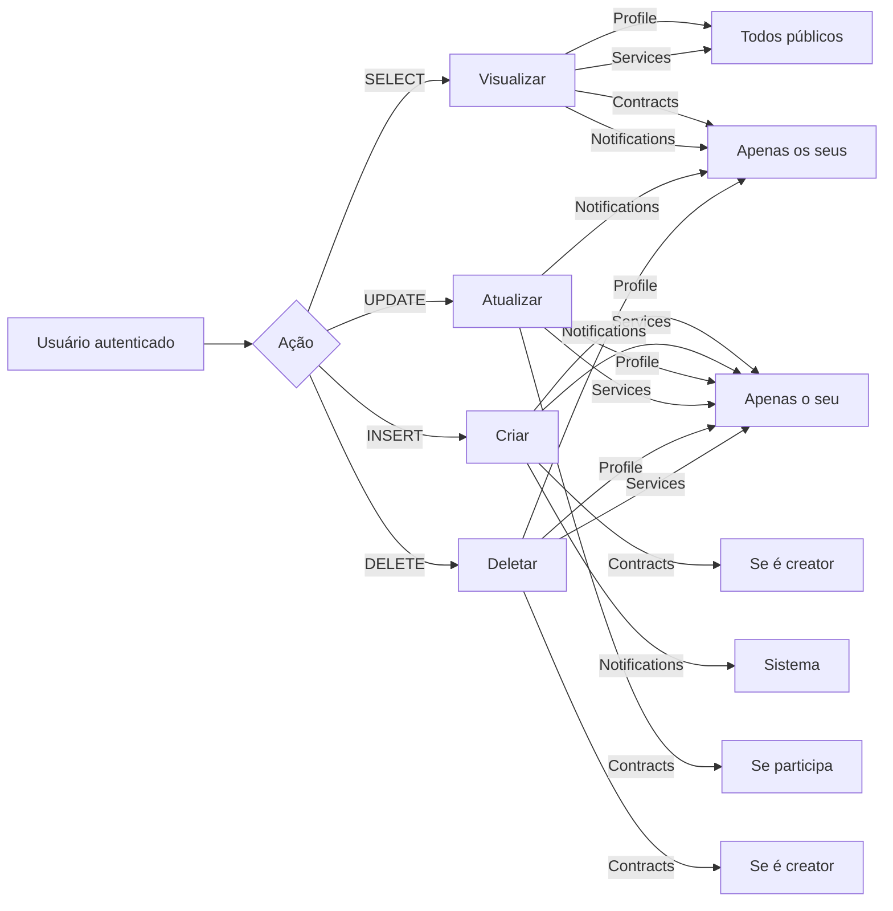
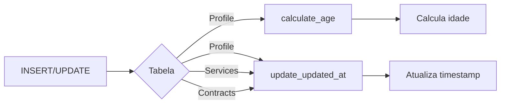

# 📊 Diagrama do Banco de Dados

## Diagrama ER (Entity Relationship)



## Fluxo de Dados



## Políticas RLS



## Índices e Performance

| Tabela | Índice | Tipo | Objetivo |
|--------|--------|------|----------|
| profile | id_auth | B-tree | Busca rápida por usuário |
| profile | type | B-tree | Filtrar por tipo |
| profile | tags | GIN | Busca full-text em tags |
| services | id_user | B-tree | Listar serviços do usuário |
| services | criado_em | B-tree | Ordenação cronológica |
| contracts | id_creator | B-tree | Contratos criados |
| contracts | id_contratado | B-tree | Contratos recebidos |
| contracts | status | B-tree | Filtrar por status |
| notifications | id_contratado | B-tree | Notificações do usuário |
| notifications | lida | B-tree | Filtrar não lidas |

## Triggers Automáticos



## Views Disponíveis

### contracts_full
Combina dados de contratos com perfis de criador e contratado.

```sql
SELECT c.*, 
       creator.name as creator_name,
       contracted.name as contracted_name
FROM contracts c
LEFT JOIN profile creator ON c.id_creator = creator.id
LEFT JOIN profile contracted ON c.id_contratado = contracted.id
```

### notifications_full
Combina notificações com dados do contrato e perfil.

```sql
SELECT n.*, 
       p.name as contratado_name,
       c.objetivo, c.valor, c.prazo
FROM notifications n
JOIN profile p ON n.id_contratado = p.id
JOIN contracts c ON n.contracts = c.id
```

## Tipos de Dados

### Enums Simulados

**profile.type:**
- `1` = Prestador de Serviço
- `2` = Cliente

**contracts.status:**
- `pendente` = Aguardando assinatura
- `ativo` = Em andamento
- `concluido` = Finalizado
- `cancelado` = Cancelado

### Formatos de String

**profile.typePersonal:**
- CPF: 11 dígitos numéricos
- CNPJ: 14 dígitos numéricos

**profile.tags:**
- Formato: `tag1-tag2-tag3`
- Exemplo: `frontend-backend-fullstack-react-nodejs`

## Checklist de Integridade

- ✅ Todas as FKs possuem ON DELETE CASCADE ou SET NULL apropriado
- ✅ Campos NOT NULL validados
- ✅ Constraints de CHECK aplicados (valores positivos, enums)
- ✅ Índices para colunas frequentemente consultadas
- ✅ RLS habilitado em todas as tabelas
- ✅ Triggers para automações
- ✅ Timestamps automáticos
- ✅ Views para queries complexas
